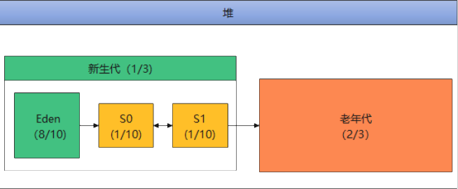

# JVM

## 堆内存

服务器JVM默认的`初始化`和`最大堆内存`是物理内存的四分之一。比如服务器内存是`16g`，则默认的最大堆内存是`4g`。
可以通过 `JVM` 启动参数`-Xms`(初始化堆大小)和`-Xmx`(最大堆大小)来指定`初始化堆大小`和`最大堆大小`。

### 年轻代大小

默认情况下，年轻代大小由参数`NewRatio`控制(服务器JVM默认配置为2)。设置`-XX:NewRatio=3`意味着年轻代和老年代之间的比率为`1：3`。换句话说，伊甸园空间和幸存者空间的总大小将是堆总大小的四分之一。
年轻代的最大大小将根据总堆的最大大小和NewRatio参数的值来计算。

### 幸存者空间

幸存者空间有2个，采用标志复制算法回收。服务器JVM默认配置大小为年轻一代的八分之一，也就是说Survivor1：Survivor2:eden =1:1:8

### 分代

### 例子

### 参数说明

|  参数   | 说明 |默认值|
|  ----  | ----  |----|
| -XX:InitialHeapSize | 初始化堆内存，通过-Xms 设置|系统内存1/64|
| -XX:MaxHeapSize | 最大堆内存，通过-Xmx 设置|系统内存四分之一 |
| -XX:OldSize| 老年代内存大小 |默认为堆内存的三分之二|
| -XX:NewSize | 新生代内存大小 |默认为堆内存的三分之一|

## 参考链接
[https://docs.oracle.com/javase/8/docs/technotes/guides/vm/gctuning/parallel.html#sthref30](https://docs.oracle.com/javase/8/docs/technotes/guides/vm/gctuning/parallel.html#sthref30)
